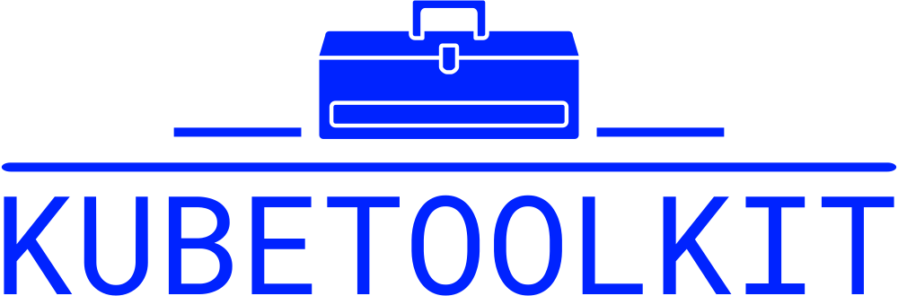

Kubernetes Toolkit(<b>kubetlkt</b>) is a tool that seemlesly launches an ephimeral pod from a container image containing an opiniated set of tools to investigate and troubleshoot a Kubernetes cluster. It does not make use of the ephimeral containers future for compatibility reasons with clusters running Kubernetes version prior to 1.25

## Tools

`curl` 
`wget` 
`jq` 
`unzip` 
`dnsutils` 
`traceroute` 
`telnet` 
`netcat` 
`net-tools` 